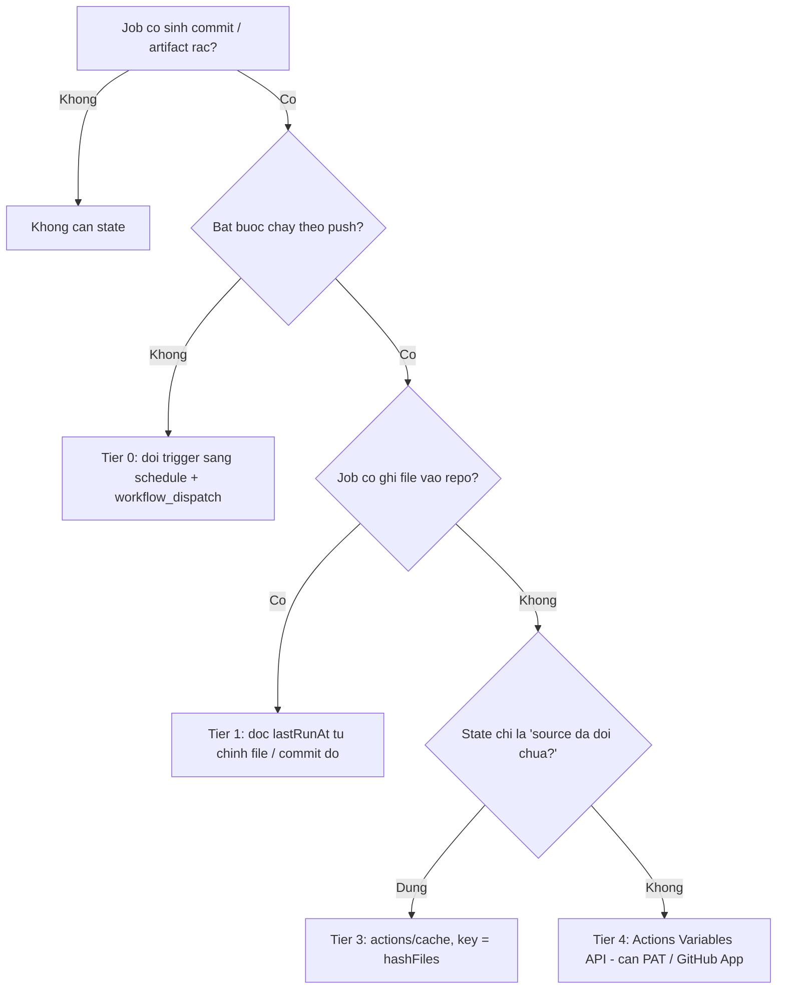

# 005 - Automation Workflow (GitHub Actions)

**Reference implementation**: `ccweb-front/.github/workflows/build.yml` (auto changelog dev).
Mọi pattern trong rule này đều trích từ workflow đó — khi phân vân, mở nó ra đọc.

Rule áp dụng cho mọi workflow **ghi ngược vào repo**: changelog, version bump, codestyle
autofix (Duster / Pint / php-cs-fixer), README version table, tracked build binaries.

---

## 1. Checklist bắt buộc

Copy template xong thì dò lại đúng 7 dòng này. Thiếu 1 dòng = workflow không được merge.

| # | Yêu cầu | Mục |
|---|---------|-----|
| 1 | Bot commit message chứa `[skip ci]` | §2.1 |
| 2 | Guard cho event mà GitHub **không** tự honor skip-ci | §2.2 |
| 3 | Job sinh commit phải có run budget (`lastRunAt`) | §3 |
| 4 | Ghi doc bằng marker block — update in-place, không append mỗi run | §4 |
| 5 | Không `git commit` khi nội dung thực sự không đổi | §5 |
| 6 | `concurrency` group + push có rebase/retry (cấm `git push \|\| true`) | §6 |
| 7 | `permissions` tối thiểu, khai báo ở cấp job | §7 |

---

## 2. Skip-CI Rule (bắt buộc — xem `000-general-rules` §7 Git)

### 2.1 Commit message của bot

```bash
git commit -m "chore(changelog): update for ${ver} [skip ci]"
```

Marker có thể nằm bất kỳ đâu trong commit message (GitHub quét cả body), nhưng **luôn viết
lowercase `[skip ci]`**: docs của GitHub không cam kết native skip là case-insensitive.
Chỉ `contains()` trong expression mới được docs khẳng định "not case sensitive".

### 2.2 GitHub chỉ tự skip cho `push` và `pull_request`

Đây chính là chỗ hay thiếu khi copy workflow qua project mới.

GitHub tự bỏ qua run khi **HEAD commit message** chứa một trong:
`[skip ci]` `[ci skip]` `[no ci]` `[skip actions]` `[actions skip]`
(hoặc trailer `skip-checks: true` đặt cuối message sau 2 dòng trống)
— nhưng **chỉ với event `push` và `pull_request`**.

Các event sau **KHÔNG** được skip tự động, phải tự guard:

`release` · `workflow_dispatch` · `workflow_run` · `schedule` · `repository_dispatch` ·
`issue_comment` · `pull_request_target`

Ngoài ra: commit do `GITHUB_TOKEN` đẩy lên **không** trigger workflow mới. Nhưng commit do
PAT / Deploy key / GitHub App đẩy lên **thì có** → luôn cần guard, đừng dựa vào may mắn.

### 2.3 Guard dạng expression (rẻ, dùng khi chỉ có event `push`)

```yaml
jobs:
  build:
    # contains() trong GitHub expression so sanh chuoi KHONG phan biet hoa/thuong,
    # nen 3 bien the la du - khong can liet ke SKIP CI / Skip-CI / SKIP_CI.
    if: >-
      !contains(github.event.head_commit.message, 'skip ci') &&
      !contains(github.event.head_commit.message, 'skip-ci') &&
      !contains(github.event.head_commit.message, 'skip_ci')
```

`github.event.head_commit` chỉ tồn tại với event `push`. Với event khác nó là `null`,
`contains(null, ...)` trả `false` → job vẫn chạy (đúng ý cho `workflow_dispatch` thủ công).

### 2.4 Guard job (dùng khi workflow nhận nhiều loại event)

```yaml
jobs:
  guard:
    name: Skip-CI guard
    runs-on: ubuntu-latest
    outputs:
      should_run: ${{ steps.check.outputs.should_run }}
    steps:
      - uses: actions/checkout@v5
        with:
          fetch-depth: 1

      - id: check
        shell: bash
        env:
          ACTOR: ${{ github.actor }}
          PR_TITLE: ${{ github.event.pull_request.title }}
        run: |
          set -euo pipefail
          subject=$(git log -1 --pretty=%s)

          # Rule 000 SS7: match skip ci / skip-ci / skip_ci / ci skip / no ci, case-insensitive
          if printf '%s\n%s' "$subject" "${PR_TITLE:-}" \
              | grep -qiE '\[?((skip|no)[ _-]?ci|ci[ _-]?skip)\]?'; then
            echo "Skip marker found -> stop."
            echo "should_run=false" >> "$GITHUB_OUTPUT"; exit 0
          fi

          # Never react to our own bot commits
          if [[ "$ACTOR" == "github-actions[bot]" ]]; then
            echo "Triggered by bot -> stop."
            echo "should_run=false" >> "$GITHUB_OUTPUT"; exit 0
          fi

          echo "should_run=true" >> "$GITHUB_OUTPUT"

  build:
    needs: guard
    if: needs.guard.outputs.should_run == 'true'
    runs-on: ubuntu-latest
    steps: []
```

---

## 3. Run budget — `lastRunAt` / throttle

Vấn đề thực tế: Duster autofix, changelog dev, rebuild binary được track bởi git —
cứ mỗi push là đẻ một commit rác dù source chẳng khác gì nhau (cùng md5).

### 3.1 Cây quyết định



Đi từ trên xuống, **dừng ở tier đầu tiên áp dụng được**. Đừng nhảy cóc xuống Tier 4.

### 3.2 Tier 0 — bỏ state, đổi trigger (ưu tiên số 1)

Duster và changelog-weekly bản chất là việc **định kỳ**, không phải việc theo push:

```yaml
on:
  schedule:
    - cron: '0 18 * * 0'   # 01:00 ICT thu Hai hang tuan (cron chay theo UTC)
  workflow_dispatch:
```

Rẻ nhất: không state, không token, không secret. Trước khi nghĩ tới state, hỏi
"việc này có thật sự cần biết về từng commit không?".

### 3.3 Tier 1 — state tự chứa trong repo (DEFAULT khi buộc phải chạy on-push)

Đọc `lastRunAt` từ **chính thứ mà workflow đã ghi ra lần trước**. Không cần store ngoài.

`ccweb-front` làm đúng như vậy — parse ngày từ header `## [ver] - YYYY-MM-DD` của
`CHANGELOG.md`:

```bash
THRESHOLD_DAYS="${{ vars.CHANGELOG_DEV_THRESHOLD_DAYS || '7' }}"

last_entry_line=$(grep -m1 '^## \[' CHANGELOG.md || true)
last_date=$(echo "$last_entry_line" | sed -E 's/.* - ([0-9]{4}-[0-9]{2}-[0-9]{2}).*/\1/')

if [[ -n "$last_date" ]]; then
  diff_days=$(( ( $(date +%s) - $(date -d "$last_date" +%s) ) / 86400 ))
  echo "Latest entry is $diff_days days old (threshold: $THRESHOLD_DAYS)"
fi
```

Khi không có file để parse thì hỏi thẳng git — dùng cho Duster / rebuild binary:

```bash
# Timestamp lan cuoi bot commit cho dung job nay
last_run=$(git log -1 --format=%cI --fixed-strings --grep='chore(duster)' || true)

if [[ -n "$last_run" ]]; then
  age_days=$(( ( $(date +%s) - $(date -d "$last_run" +%s) ) / 86400 ))
  if (( age_days < ${THRESHOLD_DAYS:-7} )); then
    echo "Within budget ($age_days/$THRESHOLD_DAYS days) -> skip."
    exit 0
  fi
fi
```

> Bắt buộc `fetch-depth: 0` ở bước `actions/checkout` — mặc định depth=1 sẽ không thấy
> commit cũ và mọi throttle đều fail-open.

- **Ưu**: 0 setup, 0 token, 0 secret. Audit trail chính là git history. Đúng cả khi
  re-run, khi fork, khi restore repo từ backup.
- **Nhược**: chỉ dùng được khi workflow có ghi thứ gì đó vào repo.
- **Fail-open**: mất state → chạy thừa 1 lần, vô hại. Đúng khẩu vị cho throttle.

### 3.4 Tier 2 — `vars.*` chỉ chứa CONFIG, không chứa state

Đọc repo variable qua `vars` context là **miễn phí, không cần token**:

```yaml
env:
  THRESHOLD_DAYS: ${{ vars.CHANGELOG_DEV_THRESHOLD_DAYS || '7' }}
```

Đổi nhịp chạy = sửa 1 ô ở *Settings → Secrets and variables → Actions → Variables*,
không cần đụng vào file workflow, không cần commit. Đây là cách `ccweb-front` đang dùng.

Luôn có `|| 'default'` để workflow chạy được trên repo mới chưa set variable.

### 3.5 Tier 3 — `actions/cache` khi state là "source đã đổi chưa"

Đúng cho case binary rebuild: state cần lưu là **hash của source**, không phải timestamp.

```yaml
- uses: actions/cache@v4
  id: build-stamp
  with:
    path: .build-stamp
    key: build-${{ hashFiles('scripts/portscan/**/*.go', 'scripts/portscan/go.sum') }}

- name: Build
  if: steps.build-stamp.outputs.cache-hit != 'true'
  run: go build -trimpath -ldflags="-s -w" -o portscan-linux-amd64 .
```

Giới hạn phải nhớ:

- Cache bị xoá sau **7 ngày không được truy cập** → không dùng cho window dài hơn 7 ngày.
- Mặc định **10 GB / repo** (repo mới có thể vượt được, nhưng đừng dựa vào).
- Cache **immutable**: không ghi đè cùng key. Muốn "mutable state" phải dùng key có
  `run_id` + `restore-keys` prefix → đẻ rác cache entry mỗi run.
- Scope theo branch: run chỉ đọc được cache của **branch hiện tại + default branch**
  (PR đọc thêm base branch). Branch con/anh em **không** thấy cache của nhau.

### 3.6 Tier 4 — Actions Variables API (ghi) — chỉ khi thật sự cần

```yaml
- name: Bump lastRunAt
  env:
    GH_TOKEN: ${{ secrets.AUTOMATION_PAT }}
  run: |
    cur=$(gh variable list --repo "$GITHUB_REPOSITORY" \
            --json name,value -q '.[] | select(.name=="LAST_RUN_AT") | .value')
    echo "previous=$cur"
    gh variable set LAST_RUN_AT --repo "$GITHUB_REPOSITORY" --body "$(date -u +%FT%TZ)"
```

- `GITHUB_TOKEN` **bị GitHub chặn cứng** ở endpoint `/actions/variables` — kể cả khi đã
  cấp `actions: write`. Đây là giới hạn cố ý, không phải bug cấu hình.
- Bắt buộc **fine-grained PAT** với permission *Variables: read & write*, hoặc GitHub App
  token qua `actions/create-github-app-token` (đỡ phải rotate secret dài hạn).
- Giới hạn 48 KB / variable.
- Dữ liệu nhạy cảm thì dùng `gh secret set` (write-only, không đọc lại được).

### 3.7 Cấm

- ❌ **Orphan branch làm state store** — đúng cái "rác git history" đang muốn tránh, cộng
  race condition khi 2 run song song.
- ❌ **Artifact của run trước làm state** — phải query API tìm run cuối, retention 90 ngày,
  không đáng công.
- ❌ **Gist / issue body** — state nằm ngoài tầm review và ngoài quyền repo.
- ❌ `GITHUB_ENV` / `GITHUB_OUTPUT` / `GITHUB_STATE` — chỉ sống trong 1 run, không phải store.

---

## 4. Idempotent doc block — marker pattern

Sai lầm kinh điển: mỗi push append thêm một section `## [dev-abc1234]` vào `CHANGELOG.md`
→ sau một tuần file có 40 entry vô nghĩa.

`ccweb-front` giải quyết bằng **marker block**: entry dev nằm giữa 2 HTML comment. Mỗi lần
chạy thì xoá block cũ rồi ghi lại block mới. Khi block đủ già (quá threshold) thì chỉ
**gỡ marker** — nội dung được "đóng băng" thành lịch sử thật, và block dev mới sẽ mọc ở trên.

```markdown
# Changelog

<!-- DEV_CHANGELOG_START -->
## [dev-abc1234] - 2026-08-21

- feat: add ocop favorites (abc1234)
- fix: feedback thread sender polymorphism (9f31c02)
<!-- DEV_CHANGELOG_END -->

## [v1.2.0] - 2026-08-01
```

```bash
# 1) Qua threshold -> go marker, block cu tro thanh lich su vinh vien
if (( diff_days >= THRESHOLD_DAYS )); then
  sed -i '/<!-- DEV_CHANGELOG_.* -->/d' CHANGELOG.md
fi

# 2) Con trong threshold va marker van con -> xoa nguyen block cu, chuan bi ghi de
if grep -q '<!-- DEV_CHANGELOG_START -->' CHANGELOG.md; then
  sed -i '/<!-- DEV_CHANGELOG_START -->/,/<!-- DEV_CHANGELOG_END -->/d' CHANGELOG.md
fi

# 3) Release -> luon xoa block dev truoc khi chen section release
```

### 4.1 Chọn range cho `git log` từ chính changelog

Đừng dùng `HEAD~1` hay `git log` toàn bộ. Lấy ref cuối cùng đã ghi trong changelog:

```bash
last_ref=$(grep -m1 '^## \[' CHANGELOG.md | sed -E 's/.*\[(.*)\].*/\1/')
base_ref=${last_ref#dev-}          # 'dev-abc1234' -> 'abc1234'; tag thi giu nguyen

if [[ -n "$base_ref" ]] && git cat-file -e "$base_ref" 2>/dev/null; then
  git_log=$(git log "${base_ref}..HEAD" --pretty=format:'- %s (%h)')
else
  # Fallback bat buoc: squash merge lam hash cu bien mat khoi history
  last_tag=$(git tag --list --sort=-version:refname | head -n1 || true)
  git_log=$(git log ${last_tag:+"$last_tag..HEAD"} --pretty=format:'- %s (%h)')
fi

[[ -z "$git_log" ]] && git_log='- No notable changes'
```

---

## 5. No-op guard — đừng commit thứ không đổi

### 5.1 File text

```bash
git add -- CHANGELOG.md
if git diff --cached --quiet; then
  echo "Nothing changed -> skip commit."
else
  git commit -m "chore(changelog): update for ${ver} [skip ci]"
fi
```

### 5.2 Binary được track bởi git

Binary build lại luôn khác byte (timestamp, PE header, build-id) dù source y hệt → git
báo `changed` vĩnh viễn. Chọn 1 trong 2:

**(a) Reproducible build** — tốt nhất nếu toolchain hỗ trợ:

```yaml
env:
  SOURCE_DATE_EPOCH: ${{ github.event.repository.pushed_at }}
```

| Stack | Flag |
|---|---|
| Go | `-trimpath -buildvcs=false -ldflags="-s -w -buildid="` |
| Rust | `--remap-path-prefix`, `-C metadata=<fixed>` |
| .NET | `<Deterministic>true</Deterministic>` + `ContinuousIntegrationBuild=true` |
| C/C++ | `-ffile-prefix-map=`, `-Wl,--build-id=none` |

**(b) Source-hash stamp** — self-contained, không phụ thuộc toolchain:

```bash
src_hash=$(git ls-files -s scripts/portscan/ | git hash-object --stdin)

if [[ -f .build-stamp && "$(cat .build-stamp)" == "$src_hash" ]]; then
  echo "Source unchanged -> no rebuild, no commit."
  exit 0
fi

# ... build ...

echo "$src_hash" > .build-stamp
git add -- .build-stamp scripts/portscan/portscan-linux-amd64
git diff --cached --quiet || \
  git commit -m "build(portscan): refresh binaries for ${src_hash:0:7} [skip ci]"
```

`.build-stamp` chính là state Tier 1: đọc được, review được, không cần token.

---

## 6. Git identity, push an toàn, concurrency

```yaml
concurrency:
  group: ${{ github.workflow }}-${{ github.ref }}
  cancel-in-progress: false   # false cho job co ghi repo - tranh push do dang
```

```bash
git config user.name  "github-actions[bot]"
git config user.email "41898282+github-actions[bot]@users.noreply.github.com"
```

Dùng đúng identity bot để commit hiện avatar bot và lọc được bằng `--author`.
(`action@github.com` / `GitHub Action` là bản cũ — vẫn chạy nhưng không gắn với bot account.)

```bash
# GIT PUSH || TRUE LA CAM: nuot loi, hong im lang, khong ai biet.
for attempt in 1 2 3 4; do
  git pull --rebase --autostash origin "$GITHUB_REF_NAME" || true
  if git push origin "HEAD:$GITHUB_REF_NAME"; then exit 0; fi
  sleep $(( 2 ** attempt ))
done
echo "git push failed after 4 attempts" >&2
exit 1
```

`actions/checkout` phải bật `fetch-depth: 0` cho mọi job đọc git history, tag, hoặc throttle.

---

## 7. Permissions

Khai báo tối thiểu, ưu tiên đặt ở **cấp job** thay vì root:

```yaml
permissions:
  contents: read            # root: read-only

jobs:
  changelog:
    permissions:
      contents: write       # commit + push
      actions: write        # BAT BUOC neu co xoa artifact
```

---

## 8. Version & artifact management

- **Release**: version = tag name (`v1.0.0`). **Dev**: `dev-<short-sha>`.
- **Naming**: `{ProjectName}-{Version}.zip`.
- **Dev artifacts**: giữ 3 bản gần nhất, xoá phần còn lại.
- **Release artifacts**: xoá artifact của run ngay sau khi upload xong lên Release.
- **README version table** (release only): giữ tối đa 8 dòng, format `| Version | Date | Notes |`.

### 8.1 Dọn dev artifact

```yaml
- uses: actions/github-script@v7
  with:
    script: |
      const prefix = `${process.env.PROJECT_NAME}-dev-`;
      const { data } = await github.rest.actions.listArtifactsForRepo({
        owner: context.repo.owner, repo: context.repo.repo, per_page: 100,
      });
      const olds = data.artifacts
        .filter(a => a.name.startsWith(prefix))
        .sort((a, b) => new Date(b.created_at) - new Date(a.created_at))
        .slice(3);
      for (const art of olds) {
        try {
          await github.rest.actions.deleteArtifact({
            owner: context.repo.owner, repo: context.repo.repo, artifact_id: art.id,
          });
          core.info(`Deleted ${art.name}`);
        } catch (e) {
          core.warning(`Failed ${art.name}: ${e.message}`);
        }
      }
```

---

## 9. Build snippet theo stack

```yaml
# .NET
- uses: actions/setup-dotnet@v4
  with: { dotnet-version: '8.0.x' }
- run: dotnet publish [PROJECT_PATH] -c Release -o ./publish

# Node.js (npm)
- uses: actions/setup-node@v4
  with: { node-version: '20', cache: 'npm' }
- run: npm ci && npm run build

# pnpm + Tauri (ccweb-front)
- uses: pnpm/action-setup@v3
  with: { version: latest }
- uses: actions/setup-node@v4
  with: { node-version: 20, cache: 'pnpm' }
- uses: dtolnay/rust-toolchain@stable
- run: pnpm install --frozen-lockfile && pnpm run tauri:build:debug

# PHP / Laravel
- uses: shivammathur/setup-php@v2
  with: { php-version: '8.3' }
- run: composer install --no-interaction --no-progress --prefer-dist

# Python
- uses: actions/setup-python@v5
  with: { python-version: '3.12' }
- run: pip install -r requirements.txt
```

---

## 10. Customization points khi bê sang project mới

| Thay gì | Ở đâu |
|---|---|
| `PROJECT_NAME` | `env:` ở đầu file |
| Build command | §9 theo stack |
| Output path | step `Collect bundle outputs` |
| Runner OS | `runs-on:` — build binary Windows phải `windows-latest` |
| Throttle window | `vars.<X>_THRESHOLD_DAYS`, không hardcode |
| Paths filter | `on.push.paths` — lọc sớm rẻ hơn mọi guard phía sau |

`on.push.paths` là lớp throttle rẻ nhất và hay bị quên: Duster chỉ cần chạy khi
`**/*.php` đổi, build binary chỉ cần chạy khi source của nó đổi.
