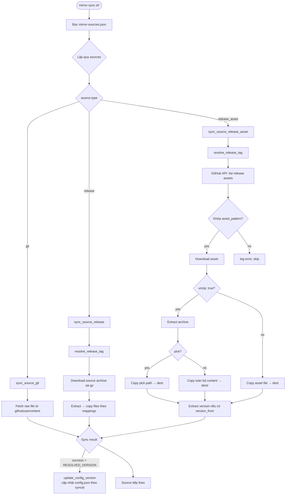
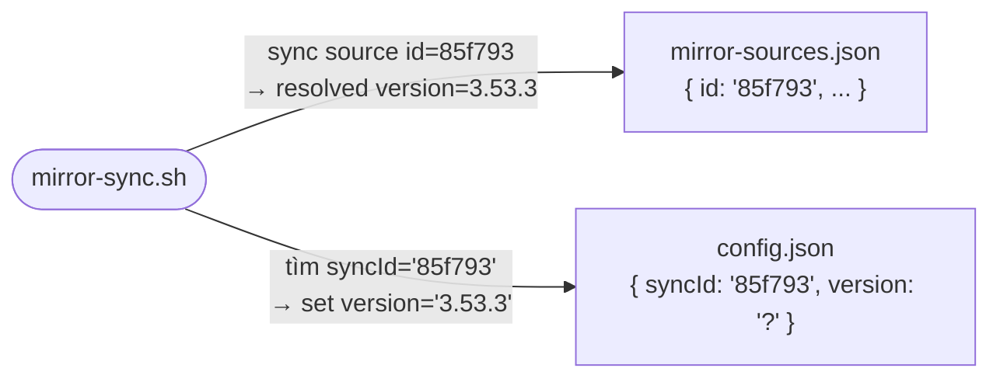
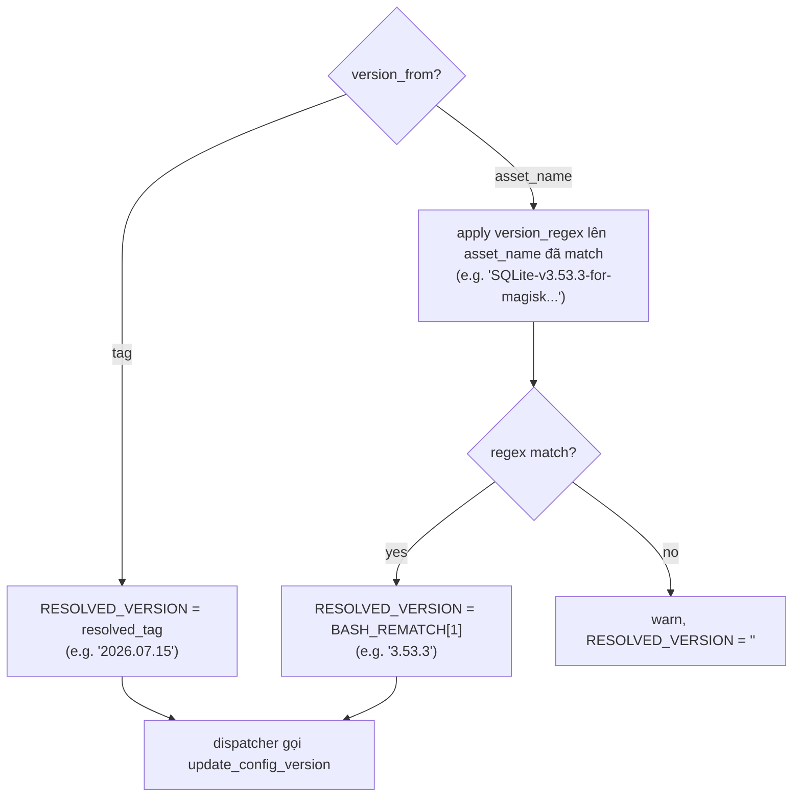
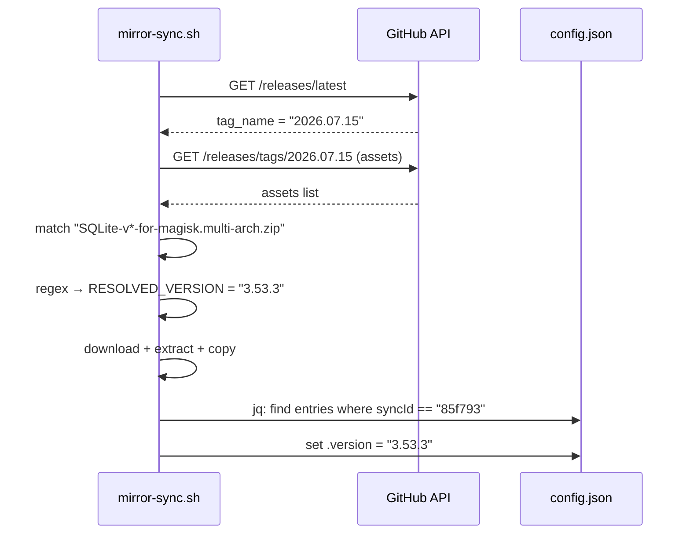

# Mirror Source Sync

Hệ thống đồng bộ file từ các repository GitHub bên ngoài về repo hiện tại, được điều khiển bởi file cấu hình `scripts/mirror-sources.json`.

---

## Tổng quan kiến trúc



---

## Vai trò của `id`

> **`id` là định danh duy nhất của mỗi source entry — và là cầu nối giữa `mirror-sources.json` và `config.json`.**

### Hai chức năng chính:

**1. Filter khi chạy tay:**
```bash
# Chỉ sync source có id = "85f793"
./scripts/mirror-sync.sh --source-id 85f793
```

**2. Liên kết với `config.json` để auto-update version:**

Trong `config.json`, mỗi metadata entry có thể khai báo `syncId`:
```json
"sqlite3-arm64": {
  "version": "3.53.3",
  "syncId": "85f793"     ← khớp với id của source trong mirror-sources.json
}
```

Sau khi sync thành công, script tự động tìm tất cả entries có `syncId` khớp và cập nhật `version`.



> **Quy tắc đặt `id`:** Dùng hex ngắn (6–8 ký tự), duy nhất trong toàn bộ file. Không thay đổi `id` sau khi đã dùng — đổi id sẽ phá vỡ liên kết với `config.json`.

---

## Cấu hình: `scripts/mirror-sources.json`

### Schema tổng quát

```json
{
  "sources": [
    {
      "id":          "<string: hex duy nhất>",
      "type":        "<git | release | release_asset>",
      "name":        "<string: tên hiển thị>",
      "description": "<string: mô tả ngắn (optional)>",
      ...fields theo type...,
      "mappings": [...]
    }
  ]
}
```

---

### Type 1: `git` — Sync file từ branch

Fetch file trực tiếp qua `raw.githubusercontent.com`. Không cần GitHub API.

```json
{
  "id": "a7f3c9",
  "type": "git",
  "name": "My Rule File",
  "repo": "https://github.com/owner/repo",
  "branch": "main",
  "mappings": [
    {
      "source": "path/in/repo/file.txt",
      "dest": "local/dest/file.txt"
    }
  ]
}
```

| Field | Required | Mô tả |
|-------|----------|-------|
| `repo` | ✅ | GitHub repo URL |
| `branch` | ✅ | Branch name |
| `mappings[].source` | ✅ | Đường dẫn file trong repo nguồn |
| `mappings[].dest` | ✅ | Đường dẫn đích (relative từ repo root) |

> **Lưu ý:** Không hỗ trợ wildcard trong `source`. Mỗi mapping là một file cụ thể.

---

### Type 2: `release` — Sync file từ source archive của release

Download `source.tar.gz` của một release tag, giải nén, rồi copy file theo mapping.

```json
{
  "id": "def456",
  "type": "release",
  "name": "My Tool Source",
  "repo": "https://github.com/owner/repo",
  "tag": "v2.1.0",
  "mappings": [
    {
      "source": "src/tool/binary",
      "dest": "tools/binary"
    }
  ]
}
```

| Field | Required | Mô tả |
|-------|----------|-------|
| `repo` | ✅ | GitHub repo URL |
| `tag` | ✅ | Tag name, hoặc `"latest"` để tự resolve |
| `mappings[].source` | ✅ | Đường dẫn trong source archive (bỏ qua top-level dir tự động) |
| `mappings[].dest` | ✅ | Đường dẫn đích |

**Version auto-update:** Luôn dùng resolved tag làm version.

---

### Type 3: `release_asset` — Sync release asset (có hỗ trợ extract)

Fetch danh sách assets từ GitHub API, match theo wildcard pattern, download và tùy chọn extract.

```json
{
  "id": "85f793",
  "type": "release_asset",
  "name": "SQLite3 (arm64)",
  "repo": "https://github.com/rojenzaman/sqlite3-magisk-module",
  "tag": "latest",
  "version_from": "asset_name",
  "version_regex": "SQLite-v([0-9.]+)-",
  "mappings": [
    {
      "asset_pattern": "SQLite-v*-for-magisk.multi-arch.zip",
      "unzip": true,
      "pick": "system/bin/sqlite3.arm64",
      "dest": "sqlite3-arm64"
    }
  ]
}
```

#### Fields cấp source

| Field | Required | Default | Mô tả |
|-------|----------|---------|-------|
| `repo` | ✅ | — | GitHub repo URL |
| `tag` | ✅ | — | Tag name hoặc `"latest"` |
| `version_from` | ❌ | `"tag"` | Nguồn lấy version: `"tag"` hoặc `"asset_name"` |
| `version_regex` | ❌ | — | Regex với capture group 1 khi `version_from = "asset_name"` |

#### Fields trong mỗi mapping

| Field | Required | Default | Mô tả |
|-------|----------|---------|-------|
| `asset_pattern` | ✅ | — | Wildcard glob để match tên asset (hỗ trợ `*`, `?`) |
| `dest` | ✅ | — | Đường dẫn đích (relative từ repo root) |
| `unzip` | ❌ | `false` | `true` = giải nén archive trước khi copy |
| `pick` | ❌ | — | Path cụ thể bên trong archive để lấy ra. Nếu bỏ qua (và `unzip: true`), copy toàn bộ nội dung vào `dest/` |

#### Version extraction



---

## Auto-update `config.json`

Sau khi một source sync thành công, nếu `RESOLVED_VERSION` có giá trị, script tự động cập nhật `config.json`:



### Cách khai báo trong `config.json`

```json
{
  "metadata": {
    "sqlite3-arm64": {
      "version": "3.53.3",
      "syncId": "85f793",
      "note": "...",
      "description": "..."
    }
  }
}
```

> **Tên key** (`"sqlite3-arm64"`) phải khớp **chính xác** với tên file trên disk (giá trị `dest` trong mapping), vì static page dùng filename để tra cứu metadata.

---

## GitHub API & Authentication

Script dùng GitHub REST API cho `release` và `release_asset` để:
- Resolve tag `"latest"` → tag name thực
- Lấy danh sách assets của một release

**Unauthenticated:** Giới hạn 60 requests/giờ.

**Authenticated:** Set env var `GITHUB_TOKEN`:
```bash
GITHUB_TOKEN=ghp_xxxx ./scripts/mirror-sync.sh
```

Trong GitHub Actions, token được inject tự động:
```yaml
env:
  GITHUB_TOKEN: ${{ secrets.GITHUB_TOKEN }}
```

---

## CLI Reference

```bash
./scripts/mirror-sync.sh [OPTIONS]
```

| Option | Mô tả |
|--------|-------|
| `--dry-run` | Hiển thị những gì sẽ làm, không thực sự thay đổi gì |
| `--source-id <id>` | Chỉ sync source có ID cụ thể |
| `-h, --help` | Hiển thị help |

---

## Ví dụ đầy đủ

### Thêm một source mới (release_asset)

**Bước 1:** Thêm vào `scripts/mirror-sources.json`:
```json
{
  "id": "c4e812",
  "type": "release_asset",
  "name": "rclone (linux-amd64)",
  "repo": "https://github.com/rclone/rclone",
  "tag": "latest",
  "version_from": "asset_name",
  "version_regex": "rclone-v([0-9.]+)-",
  "mappings": [
    {
      "asset_pattern": "rclone-v*-linux-amd64.zip",
      "unzip": true,
      "pick": "rclone-v*-linux-amd64/rclone",
      "dest": "rclone"
    }
  ]
}
```

**Bước 2:** Thêm metadata vào `config.json`:
```json
"rclone": {
  "version": "-",
  "syncId": "c4e812",
  "note": "...",
  "description": "rclone - rsync for cloud storage"
}
```

**Bước 3:** Test với dry-run:
```bash
./scripts/mirror-sync.sh --dry-run --source-id c4e812
```
