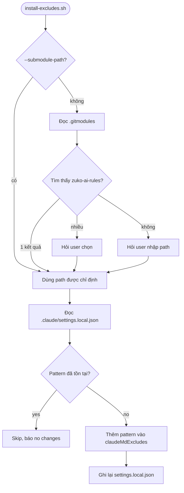

# Submodule Setup — claudeMdExcludes

Khi add repo `zuko-ai-rules` làm submodule, CLAUDE.md của repo này sẽ bị Claude Code load như instruction của parent project → gây conflict. Script `install-excludes.sh` giải quyết vấn đề này.

---

## Tổng quan



---

## Cách hoạt động

`claudeMdExcludes` là setting của Claude Code, nhận array of glob patterns. Các CLAUDE.md match pattern sẽ **không** được load.

Script thêm pattern sau vào `.claude/settings.local.json` của parent project:

```json
{
  "claudeMdExcludes": [
    "**/.agents/CLAUDE.md"
  ]
}
```

> **Tại sao `settings.local.json`?** File này không commit vào git, phù hợp cho config machine-specific. Mỗi dev chạy script 1 lần sau khi clone.

---

## CLI Reference

```bash
# Chạy từ ROOT của parent project (không phải trong submodule)
.agents/scripts/install-excludes.sh [OPTIONS]
```

| Option | Mô tả |
|--------|-------|
| `--submodule-path <path>` | Chỉ định path submodule (bỏ qua auto-detect) |
| `-h, --help` | Hiển thị help |

**Requirement:** `jq`

---

## Setup từ đầu

### Bước 1: Add submodule

```bash
git submodule add -b master https://github.com/user/zuko-ai-rules.git .agents
```

### Bước 2: Install excludes

```bash
.agents/scripts/install-excludes.sh
```

Output:
```
Auto-detected submodule path: .agents
Added to .claude/settings.local.json:
  claudeMdExcludes += ["**/.agents/CLAUDE.md"]
```

### Bước 3: Verify

```bash
cat .claude/settings.local.json
```

```json
{
  "claudeMdExcludes": [
    "**/.agents/CLAUDE.md"
  ]
}
```

---

## Kết quả

| Trước | Sau |
|-------|-----|
| Claude Code load CLAUDE.md của submodule → conflict với parent project instructions | CLAUDE.md của submodule bị exclude → chỉ rules files trong `rules/` được load theo `globs` |

> **Lưu ý:** Các file trong `rules/` vẫn hoạt động bình thường — chúng được load theo `globs` pattern trong frontmatter, không bị ảnh hưởng bởi `claudeMdExcludes`.
