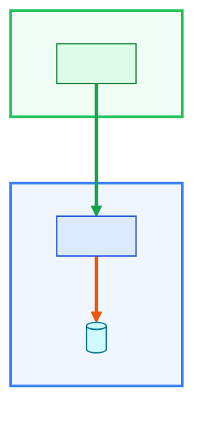
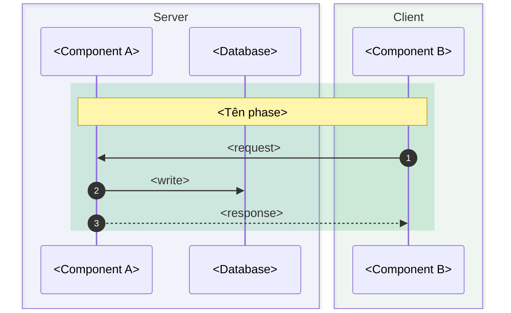
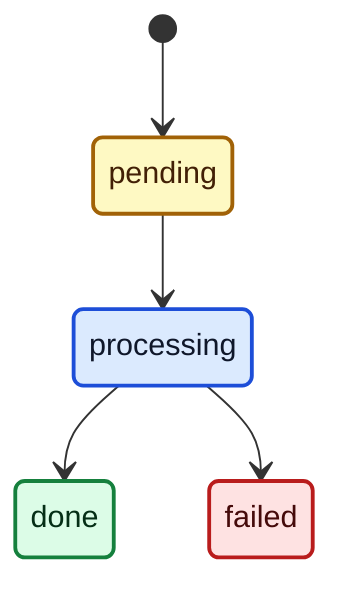

# <Module> — Architecture Overview

***<Một câu: module gồm những gì, nối với nhau ra sao — dành cho ai.>***

**Last updated:** <dán output của scripts/doc_stamp.py --paths modules/<Module>>

> [!NOTE]
> **<Mô hình tư duy cốt lõi người đọc PHẢI nắm (vd "sổ cái là nguồn sự thật, ví chỉ là cache").>**

- **Tài liệu liên quan:** [@README.md](README.md) — thứ tự đọc. <Thêm protocol/guide nếu có.>
- **Bảng màu sơ đồ** (chỉ khi > 3 nhóm màu — dùng chung mọi graph/sequence bên dưới):

| Màu | Vùng / node | Đường dẫn |
|---|---|---|
| Xanh dương | <Server> | <Lifecycle> |
| Cam | — | <Write / dispatch> |
| Xanh lá | <Client> | <Luồng xử lý chính> |
| Xám | <Producer> | <Watchdog> (nét chấm) |

## Mục lục

- [1. Thuật ngữ](#1-thuật-ngữ)
- [2. Components & vai trò](#2-components--vai-trò)
- [3. Endpoints → component](#3-endpoints--component)
- [4. Luồng dữ liệu](#4-luồng-dữ-liệu)
- [5. Lifecycle](#5-lifecycle)
- [6. Vận hành](#6-vận-hành)
- [7. Điểm cần xử lý](#7-điểm-cần-xử-lý)

<!-- §1 tuỳ chọn. §3 BẮT BUỘC khi module có HTTP / CLI / queue surface, bỏ hẳn nếu không có. -->

## 1. Thuật ngữ

| Term | Alias | Định danh trên wire/code | Mô tả |
|---|---|---|---|
| **<Term>** | <alias> | `<identifier>` | <1 câu> |

## 2. Components & vai trò

| Component | File | Vai trò |
|---|---|---|
| **<Component A>** | [@<File>.php](<relative/path/File.php>) | <1 câu> |

## 3. Endpoints → component

| Endpoint | Caller | Auth | Controller | Service → Repository | Hiệu ứng |
|---|---|---|---|---|---|
| `POST <path>` | <ai gọi> | <auth> | [@<Controller>.php](<path>) | `<Service::method>` → `<Repository>` | <thay đổi state> |

- Request/response đầy đủ: [@api-endpoints.md](api-endpoints.md) (nếu có).

## 4. Luồng dữ liệu

## 5. Lifecycle

- _Vàng = chờ · xanh dương = đang chạy · xanh lá = xong · đỏ = lỗi._
- **<Quy tắc rút ra từ sơ đồ>** — <hệ quả với người tích hợp>.

## 6. Vận hành

| Command / job | Lịch | Tác động | Ghi chú |
|---|---|---|---|
| `<artisan command>` | <cron> | <làm gì> | <hệ quả> |

Config & env

| Key | Env | Mặc định | Ý nghĩa |
|---|---|---|---|
| `<module.key>` | `<ENV>` | `<value>` | <1 câu> |

## 7. Điểm cần xử lý

| Marker | Vấn đề | Chi tiết |
|---|---|---|
| **CẦN FIX** | <lỗi đã xác minh> | [§<n>](#<anchor>) |
| **CẦN REVIEW** | <thiết kế đáng xem lại> | [§<n>](#<anchor>) |

- Tài liệu cũ lệch code → ghi vào `docs/need-reviews/code-doc-missmatch.md` (repo root), ở đây chỉ link tới.
