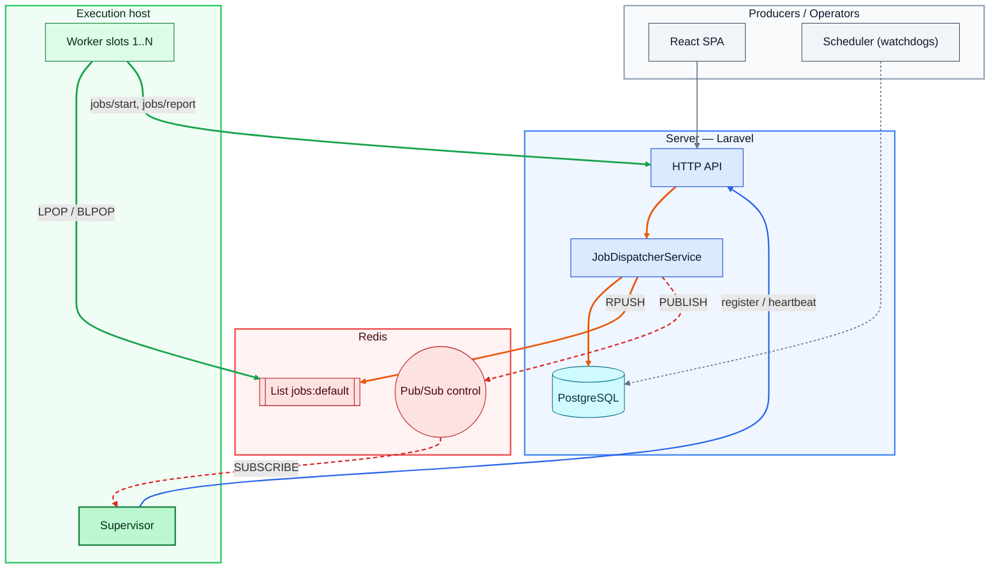
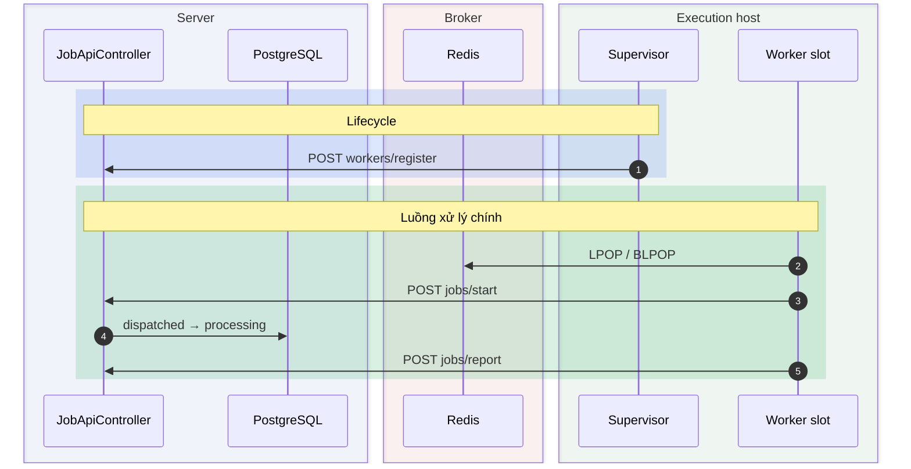
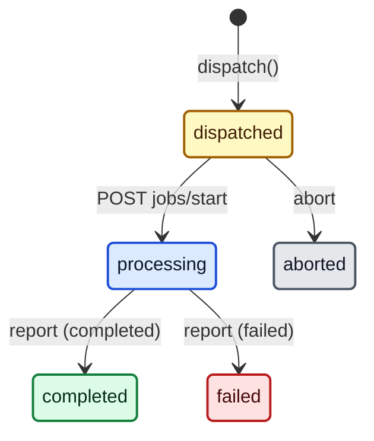

# Mermaid Styling — màu theo ngữ nghĩa, ký tự an toàn, kiểm chứng đa phiên bản

***Cách tô màu vùng và đường dẫn cho graph, sequence, state; bảng ký tự đặc biệt đã kiểm chứng trên Mermaid 10.x và 11.x; các lỗi đã gặp thực tế.***

## Mục lục

- [1. Nguyên tắc màu](#1-nguyên-tắc-màu)
- [2. Bảng màu](#2-bảng-màu)
- [3. Graph / flowchart](#3-graph--flowchart)
- [4. Sequence diagram](#4-sequence-diagram)
- [5. State diagram](#5-state-diagram)
- [6. Legend](#6-legend)
- [7. Độ phức tạp](#7-độ-phức-tạp)
- [8. Ký tự đặc biệt](#8-ký-tự-đặc-biệt)
- [9. Kiểm chứng](#9-kiểm-chứng)
- [10. Pitfalls đã gặp](#10-pitfalls-đã-gặp)

## 1. Nguyên tắc màu

- **Màu mang nghĩa, không trang trí.** Mỗi khái niệm (một vai trò như Server, hoặc một luồng như dispatch) = một nhóm màu.
  - Cùng khái niệm → cùng nhóm màu ở MỌI sơ đồ trong tài liệu. Người đọc học bảng màu một lần.
- **Không giới hạn số nhóm màu — giới hạn là độ tương phản.** Thêm khái niệm thì thêm nhóm,
  miễn là các nhóm **dễ phân biệt với nhau**:
  - Lấy nhóm theo **thứ tự trong bảng [§2.1](#21-các-nhóm-màu)** — thứ tự đó xếp sao cho các nhóm đầu cách xa nhau nhất về sắc độ.
  - KHÔNG dùng hai nhóm "anh em" trong cùng sơ đồ: blue ↔ indigo/sky, cyan ↔ teal, green ↔ emerald/lime,
    orange ↔ amber, red ↔ rose, purple ↔ violet/fuchsia, slate ↔ gray/zinc/stone. Nhìn lướt sẽ không phân biệt được.
  - Hai vùng nằm cạnh nhau hoặc hai cạnh cắt nhau → chọn hai nhóm **xa nhau** trong bảng.
    Cặp gần nhau nhất trong bảng (red–pink, orange–yellow, blue–cyan): tránh đặt sát nhau.
  - Hết 9 nhóm mà vẫn cần thêm: **tái dùng một nhóm + đổi kiểu viền** (nét đứt, viền đôi độ dày) hoặc đổi hình node.
    Ghi rõ trong legend. KHÔNG chọn thêm một sắc độ "gần giống".
- **Ba lớp đậm nhạt trong cùng một nhóm:** vùng (subgraph/box) nhạt nhất → node nhạt vừa → viền và chữ đậm.
- **LUÔN set `color:` (màu chữ) tường minh.** Theme tối đổi chữ mặc định sang sáng; chữ sáng trên nền pastel không đọc được.
- **Màu cạnh = màu của khái niệm sở hữu luồng.**
  - Luồng chạy trong/ thuộc về một vai trò → dùng chính nhóm màu của vai trò đó (cùng một khái niệm, không tạo nghĩa mới).
  - Luồng xuyên hệ thống, không thuộc vai trò nào (vd write/dispatch) → một nhóm **chưa vai trò nào dùng**.
  - Một nhóm màu dùng cho cả node lẫn cạnh trong cùng sơ đồ PHẢI là cùng một khái niệm.
- **Không dùng màu làm kênh duy nhất.** Kèm label trên cạnh, kiểu nét (liền/đứt/chấm), độ dày — cho người mù màu và bản in đen trắng.

## 2. Bảng màu

### 2.1. Các nhóm màu

- Thứ tự = thứ tự nên lấy. Hex từ thang Tailwind: 100 cho node, 50 cho vùng, 600/700 cho viền và cạnh, 900/950 cho chữ.

| # | Nhóm | Node `classDef` | Vùng `style` | Cạnh `linkStyle` | `box` / `rect` (rgba) |
|---|---|---|---|---|---|
| 1 | **blue** | `fill:#dbeafe,stroke:#1d4ed8,color:#0f172a` | `fill:#eff6ff,stroke:#3b82f6,stroke-width:2px,color:#0f172a` | `stroke:#2563eb` | `rgba(37,99,235,α)` |
| 2 | **orange** | `fill:#ffedd5,stroke:#c2410c,color:#431407` | `fill:#fff7ed,stroke:#f97316,stroke-width:2px,color:#431407` | `stroke:#ea580c` | `rgba(234,88,12,α)` |
| 3 | **green** | `fill:#dcfce7,stroke:#15803d,color:#052e16` | `fill:#f0fdf4,stroke:#22c55e,stroke-width:2px,color:#052e16` | `stroke:#16a34a` | `rgba(22,163,74,α)` |
| 4 | **purple** | `fill:#ede9fe,stroke:#6d28d9,color:#1e1b4b` | `fill:#f5f3ff,stroke:#8b5cf6,stroke-width:2px,color:#1e1b4b` | `stroke:#7c3aed` | `rgba(124,58,237,α)` |
| 5 | **red** | `fill:#fee2e2,stroke:#b91c1c,color:#450a0a` | `fill:#fef2f2,stroke:#ef4444,stroke-width:2px,color:#450a0a` | `stroke:#dc2626` | `rgba(220,38,38,α)` |
| 6 | **cyan** | `fill:#cffafe,stroke:#0e7490,color:#083344` | `fill:#ecfeff,stroke:#06b6d4,stroke-width:2px,color:#083344` | `stroke:#0891b2` | `rgba(8,145,178,α)` |
| 7 | **slate** | `fill:#f1f5f9,stroke:#475569,color:#0f172a` | `fill:#f8fafc,stroke:#94a3b8,stroke-width:2px,color:#0f172a` | `stroke:#64748b` | `rgba(100,116,139,α)` |
| 8 | **yellow** | `fill:#fef9c3,stroke:#a16207,color:#422006` | `fill:#fefce8,stroke:#eab308,stroke-width:2px,color:#422006` | `stroke:#ca8a04` | `rgba(202,138,4,α)` |
| 9 | **pink** | `fill:#fce7f3,stroke:#be185d,color:#500724` | `fill:#fdf2f8,stroke:#ec4899,stroke-width:2px,color:#500724` | `stroke:#db2777` | `rgba(219,39,119,α)` |

- α: `box` **0.05**, `rect` **0.16** — xem [§4](#4-sequence-diagram).
- Node "trưởng nhóm" (vd Supervisor trong nhóm client): cùng nhóm, thêm `stroke-width:2px`, fill đậm hơn một bậc (200).

### 2.2. Gán mặc định cho hệ phân tán

- Dùng làm điểm xuất phát; đổi được, miễn giữ quy tắc [§1](#1-nguyên-tắc-màu).

| Khái niệm | Nhóm | Ghi chú |
|---|---|---|
| Server / backend service | blue | |
| Client / worker / agent | green | |
| Broker / queue / message bus | red | |
| Domain / business module | purple | |
| Store / database | cyan | |
| Producer / operator / scheduler | slate | |
| Aux resource / config | yellow | |
| Hệ thống ngoài / execution backend | pink | |
| **Luồng** write / dispatch (xuyên hệ thống) | orange | Không vai trò nào dùng orange |
| **Luồng** xử lý chính của client | green | Thuộc client |
| **Luồng** lifecycle / đăng ký với server | blue | Control-plane của server |
| **Luồng** pub/sub, tín hiệu bất đồng bộ | red, nét đứt `stroke-dasharray:6 4` | Đi qua broker |
| **Luồng** watchdog / cron | slate, nét chấm `stroke-dasharray:3 3` | Thuộc scheduler |

- Độ dày: luồng chính `2.5px`, luồng phụ `1.5px`–`2px`.

### 2.3. Trạng thái (state diagram)

- State diagram dùng **thang màu riêng theo ngữ nghĩa trạng thái**, không theo bảng vai trò.
  PHẢI có 1 dòng chú thích ngay dưới sơ đồ (vd "vàng = chờ, xanh dương = đang chạy, …").

| Ngữ nghĩa | Nhóm | `classDef` |
|---|---|---|
| Chờ (queued, pending) | yellow | `fill:#fef9c3,stroke:#a16207,stroke-width:2px,color:#422006` |
| Đang chạy | blue | `fill:#dbeafe,stroke:#1d4ed8,stroke-width:2px,color:#0f172a` |
| Xong / online | green | `fill:#dcfce7,stroke:#15803d,stroke-width:2px,color:#052e16` |
| Lỗi / offline | red | `fill:#fee2e2,stroke:#b91c1c,stroke-width:2px,color:#450a0a` |
| Huỷ / rời hệ thống | slate | `fill:#e5e7eb,stroke:#4b5563,stroke-width:2px,color:#111827` |
| Rảnh (idle) | slate nhạt | `fill:#f1f5f9,stroke:#475569,stroke-width:2px,color:#0f172a` |

## 3. Graph / flowchart

### 3.1. Công thức

1. **Subgraph có id:** `subgraph Server["Server — Laravel"]`. Không id thì không `style` được.
2. **Node:** label có ký tự đặc biệt → `"..."` (xem [§8](#8-ký-tự-đặc-biệt)); xuống dòng bằng `<br/>`.
3. **Cạnh mỗi dòng một cạnh**, gom theo luồng, comment chỉ số: `%% 3-5 dispatch (orange)`.
4. **Cuối block:** `classDef` → `class` → `style <subgraphId>` → `linkStyle`.

### 3.2. Ví dụ đầy đủ

````markdown

````

### 3.3. Đếm cạnh cho `linkStyle`

- Chỉ số bắt đầu từ **0**, theo **thứ tự xuất hiện trong source**, kể cả cạnh khai báo bên trong subgraph.
- `A --> B --> C` = **2 cạnh**. `A & B --> C` = **2 cạnh**. Dễ đếm sai — KHÔNG dùng trong sơ đồ có `linkStyle`.
- Thêm/bớt một cạnh ở giữa → mọi chỉ số phía sau lệch. Sửa cạnh xong PHẢI soát lại toàn bộ `linkStyle`.
- Nhiều chỉ số: `linkStyle 3,4,5 stroke:…` (không khoảng trắng sau dấu phẩy).
- Nối subgraph → node được. Nối một subgraph **với chính nó** làm Mermaid 10.x crash — xem [§8](#8-ký-tự-đặc-biệt).

## 4. Sequence diagram

### 4.1. Công thức

1. `autonumber` ngay sau `sequenceDiagram`.
2. **`box`** gom participant theo vai trò — alpha **0.05**, chỉ để gợi vùng.
3. **`rect`** bọc từng phase — alpha **0.16**, mở đầu bằng `Note over A,B: <tên phase>`.
4. Thứ tự participant quyết định thứ tự cột — xếp theo hướng luồng chính chạy trái → phải.

### 4.2. Ví dụ

````markdown

````

### 4.3. Lưu ý

- **Hai `rect` cùng màu liền nhau trông như một khối** → xen `Note` tên phase, hoặc đổi màu phase kế tiếp.
- **Văn bản tham chiếu số bước `autonumber`** ("bước 11–14") lệch khi thêm/bớt message, giống lỗi đếm `linkStyle`.
  _Nên_ tham chiếu theo tên phase thay vì số bước; nếu buộc dùng số, soát lại sau mỗi lần sửa.
- **Note dài tràn khung.** Giữ ≤ ~40 ký tự mỗi dòng, xuống dòng bằng `<br/>`.
- **Self-message** (`W->>W`) giữ label ngắn — label dài đè lên lifeline ở theme sáng.
- `loop`, `alt`, `opt` lồng trong `rect` bình thường. `box` cần Mermaid ≥ 10.

## 5. State diagram

- `classDef <tên> …` rồi `class stateA,stateB <tên>` cuối block. Màu theo [§2.3](#23-trạng-thái-state-diagram).
- Tên `classDef` KHÔNG trùng tên state (vd state `failed` → class `bad`).
- Mũi tên trong `stateDiagram-v2` không tô được (không có `linkStyle`) — đặt thông tin luồng vào label.
- Label và description: KHÔNG có dấu `:` thứ hai — xem [§8](#8-ký-tự-đặc-biệt).

````markdown

````

- Chú thích dưới sơ đồ: _vàng = chờ · xanh dương = đang chạy · xanh lá = xong · đỏ = lỗi · xám = huỷ._

## 6. Legend

- **Một bảng ở đầu tài liệu** khi tổng số nhóm màu của graph/sequence > 3. Các sơ đồ bên dưới dùng lại, không lặp.
- State diagram không vào bảng này — mỗi sơ đồ có 1 dòng chú thích riêng ([§2.3](#23-trạng-thái-state-diagram)).
- Cột: Màu → Vùng / node → Đường dẫn. Ô không dùng để `—`.

```markdown
| Màu | Vùng / node | Đường dẫn |
|---|---|---|
| Xanh dương | Server | Lifecycle: `register` / `heartbeat` |
| Cam | — | Write / dispatch: tạo Job → `RPUSH` |
| Xanh lá | Execution host | Luồng xử lý chính: pop / `start` / `report` |
| Đỏ | Broker (Redis) | Pub/sub (nét đứt) |
| Xám | Producer / operator | Watchdog (nét chấm) |
```

## 7. Độ phức tạp

- **Graph > ~12 node hoặc > ~15 cạnh → tách.** Một sơ đồ tổng quan (chỉ các vùng + luồng chính) và các sơ đồ chi tiết theo luồng.
- **Sequence > ~8 participant hoặc > ~25 message → tách theo phase.**
- Dấu hiệu cần tách: phải zoom mới đọc được label, hoặc cạnh cắt nhau nhiều hơn 3 chỗ.

## 8. Ký tự đặc biệt

- Kiểm chứng bằng render thật trên **mermaid-cli 10.9.1** (Mermaid 10.9) và **11.4.2** (Mermaid 11.17).
  Nhiều renderer (IDE plugin, app viewer) còn chạy 10.x — một sơ đồ chỉ qua 11.x vẫn có thể vỡ ở máy người đọc.
- **Quy tắc chung:** label có ký tự ngoài chữ/số/khoảng trắng → _nên_ quote (flowchart) hoặc dùng entity (state, sequence).
  Entity: `#58;` = `:`, `#59;` = `;`, `#quot;` = `"`, `#40;` `#41;` = `( )`, `#35;` = `#`.

| Sơ đồ | Mẫu | 10.x | 11.x | Viết an toàn |
|---|---|---|---|---|
| flowchart node | `A[call (x)]`, `A[list [x]]`, `A[{json}]` — `( ) [ ] { }` không quote | ❌ | ❌ | `A["call (x)"]` |
| flowchart node | node id `end` (chữ thường) | ❌ | ❌ | `done`, `End` |
| flowchart node | `:` `#` `>` `<` `-` `--` không quote | ✅ | ✅ | vẫn _nên_ quote |
| flowchart node | dấu `"` trong text | — | — | `#quot;` |
| flowchart edge | label có `: ( ) > [ ]` | ✅ | ✅ | _nên_ `-- "…" -->` hoặc `-->\|"…"\|` |
| flowchart edge | `A---oB`, `A---xB` | ✅ | ✅ | ⚠ vẽ mũi tên tròn/chéo tới `B` — thêm khoảng trắng hoặc đổi id |
| flowchart edge | cạnh từ subgraph tới chính nó | ❌ crash | ✅ | nối tới node con |
| state label / description | dấu `:` thứ hai: `A --> B: x:y` | ❌ | ✅ | `x#58;y` hoặc viết lại |
| state label | quote `"x:y"` | ❌ | ⚠ hiện cả dấu `"` | không quote — dùng entity |
| state name | có `-`: `pre-check --> done` | ❌ | ❌ | `state "pre-check" as precheck` |
| state label | `( ) [ ] > < - ;` và em-dash | ✅ | ✅ | — |
| sequence message / Note | `;` | ❌ | ❌ | `#59;` hoặc viết lại |
| sequence message | `:` thứ hai, `( ) [ ] < > # %%` | ✅ | ✅ | — |
| sequence participant | id có `-`, alias có `( )` | ✅ | ✅ | — |

## 9. Kiểm chứng

- **Render thật trên nhiều phiên bản, không đoán:**

```bash
python <skill-dir>/scripts/validate_mermaid.py docs/ --png <scratch>/mermaid-png --dark
```

- Mặc định chạy mermaid-cli **10.9.1** và **11.4.2** qua `npx`; đổi bằng `--versions`.
  Block chỉ fail ở một phiên bản vẫn là FAIL.
- Dòng `HINT` chỉ ra bẫy ký tự ở [§8](#8-ký-tự-đặc-biệt) kèm số dòng — gợi ý sửa, không phải kết luận.
- **Soát mắt PNG ở cả hai theme:** chữ đọc được ở nền tối, vùng phase không đục, mỗi cạnh đúng màu luồng
  (lệch màu = đếm sai `linkStyle`).

## 10. Pitfalls đã gặp

| Triệu chứng | Nguyên nhân | Cách sửa |
|---|---|---|
| Sơ đồ render được lúc kiểm, vỡ ở máy người đọc | Chỉ kiểm một phiên bản Mermaid | Chạy `validate_mermaid.py` với mặc định 2 phiên bản |
| Cạnh sai màu, lệch một vị trí | Chuỗi `A --> B --> C` hoặc thêm cạnh giữa chừng | Mỗi cạnh một dòng, comment chỉ số, soát `linkStyle` |
| `style X` không có tác dụng | `subgraph "Title"` không có id | `subgraph X["Title"]` |
| Vùng phase sequence đục | `box` alpha cao chồng `rect` | `box` 0.05, `rect` 0.16 |
| Chữ không đọc được ở dark mode | Thiếu `color:` | Thêm `color:` màu đậm |
| Hai nhóm màu trông như nhau | Dùng hai sắc độ "anh em" (blue/indigo, green/teal…) | Lấy theo thứ tự [§2.1](#21-các-nhóm-màu) |
| Cùng một màu, người đọc hiểu hai nghĩa | Node và cạnh cùng màu nhưng khác khái niệm | Màu cạnh = khái niệm sở hữu luồng ([§1](#1-nguyên-tắc-màu)) |
| State bị tô sai | `classDef` trùng tên state | Đổi tên class |
| Alert hiện thành blockquote thường | `> [!NOTE] nội dung` chung một dòng | Marker một dòng riêng |
| Tên file lẫn `\r` khi pipe danh sách trên Windows | CRLF | Làm toàn bộ trong Python ([@validate_mermaid.py](../scripts/validate_mermaid.py)) |
